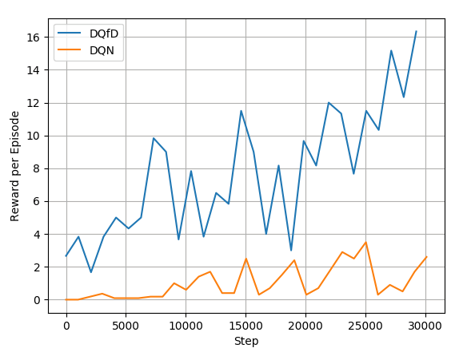
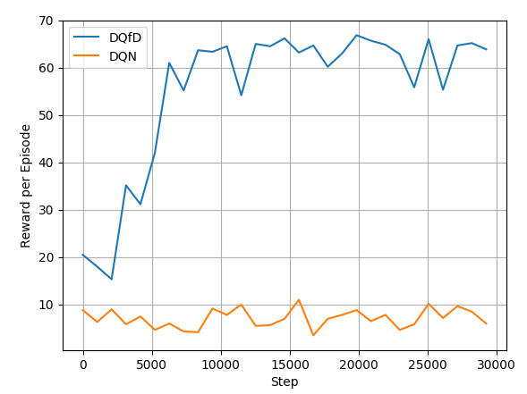

# StartCraft II Imitation Learning
This project implemented DQN, Double DQN and Deep Q-Learning from Demonstration (DQfD).
## Requirements
* Python 3.6
* PyTorch 0.3
* PySC2
* Matplotlib
* gflags
* Numpy

## Demo
- MoveToBeacon with DQfD (https://youtu.be/flJm7cwxFF4)
[](https://youtu.be/flJm7cwxFF4)
- CollectMineralShards with DQfD (https://youtu.be/_exuFA0OsPw)
[](https://youtu.be/_exuFA0OsPw)

## Results
- Cartpole
<!-- .element width="10" -->
- MoveToBeacon

- CollectMineralShards

# Quick Start Guide

## 4. Train it!
```shell
$ python cartpole.py
```


```shell
$ python starcraft.py
```

